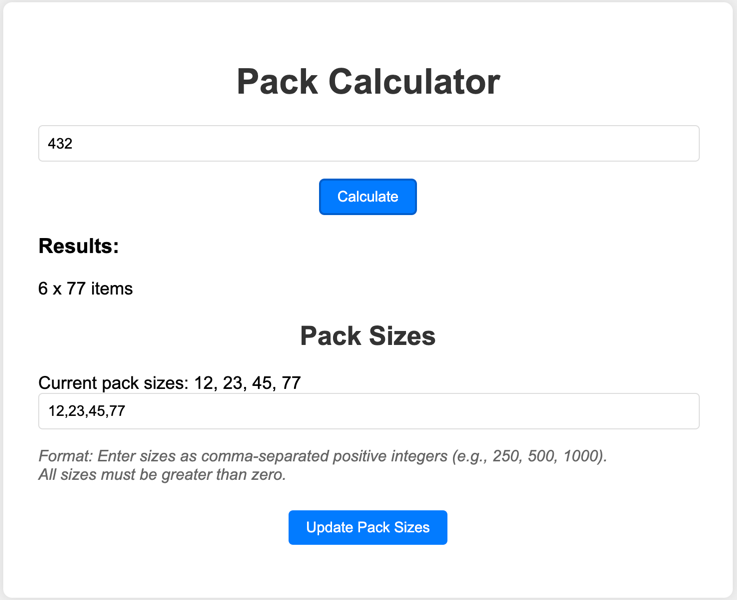

# 📦 Pack Calculator

Pack Calculator is a Go-based web application that optimizes packing solutions for given order sizes.
It's designed with clean architecture principles, ensuring scalability and maintainability.

### 🧠 Solution Approach

We approached this challenge by:
1. Implementing a greedy algorithm to calculate the optimal pack combination.
2. Designing the system using clean architecture principles, separating concerns into distinct layers:
   - Domain layer: Core business logic and entities
   - Use Case layer: Application-specific business rules
   - Interface layer: Adapters for external agency (e.g., HTTP handlers)
   - Infrastructure layer: Frameworks and tools (e.g., database, external services)
3. Creating a RESTful API for easy integration with other systems.
4. Developing a simple web interface for user interaction.
5. Containerizing the application for easy deployment and scaling.
6. Allowing customization of pack sizes through environment variables and API endpoints for flexibility.

## 🚀 Features

- Calculate optimal pack combinations for any order size 🧮
- RESTful API for system integration 🔌
- User-friendly web interface 🖥️
- Configurable pack sizes via environment variables and API 🔧
- Docker support for easy deployment 🐳
- Comprehensive Makefile for streamlined development 🛠️
- Google Cloud Run deployment for cloud scalability ☁️
- CI/CD (configured on the GCP side when merging into main) pipeline for automated testing and deployment 🚀
- Graceful shutdown for clean resource management 🛑

## 📋 Prerequisites

- Go 1.22 or higher
- Docker and Docker Compose
- Make

## 🛠️ Installation

1. Clone the repository:
   ```
   git clone https://github.com/krl4k/pack-calculator.git
   cd pack-calculator
   ```

2. Install dependencies:
   ```
   go mod download
   ```

## 🔧 Configuration

You can customize the available pack sizes by setting the `PACK_SIZES` environment variable. The sizes should be comma-separated integers.

Example:
```
export PACK_SIZES=250,500,1000,2000,5000
```

If not set, the application will use default pack sizes.

### In Docker

To set environment variables when running with Docker or Docker Compose, you can:

1. Modify the `docker-compose.yml` file:
   ```yaml
   services:
     app:
       environment:
         - PACK_SIZES=250,500,1000,2000,5000
   ```

2. Or use a `.env` file in your project root:
   ```
   PACK_SIZES=250,500,1000,2000,5000
   ```

3. Or set it directly when running Docker:
   ```
   docker run -e PACK_SIZES=250,500,1000,2000,5000 your-image-name
   ```

## 🏃‍♂️ Usage

### Makefile Commands

- `make test`: Run unit tests 🧪
- `make build`: Compile the binary 🔨
- `make run`: Build and run the application using Docker Compose 🚀
- `make stop`: Stop the running Docker containers 🛑
- `make clean`: Clean up build artifacts and Docker resources 🧹
- `make deploy-gcp`: Deploy the application to Google Cloud Run ☁️

### Running Locally

1. Build and run the application:
   ```
   make run
   ```

2. Open a web browser and navigate to `http://localhost:8080`

### Stopping the Application

To stop the application:
```
make stop
```

## 🌐 API Usage

The application exposes the following RESTful API endpoints:

### Calculate Optimal Packs
- Endpoint: `/api/calculate`
- Method: GET
- Query Parameter: `orderSize` (integer)

Example:
```
GET /api/calculate?orderSize=501
```

Response:
```json
[
  {"Size": 500, "Count": 1},
  {"Size": 250, "Count": 1}
]
```

### Get Current Pack Sizes
- Endpoint: `/api/pack-sizes`
- Method: GET

Example:
```
GET /api/pack-sizes
```

Response:
```json
[250, 500, 1000, 2000, 5000]
```

### Update Pack Sizes
- Endpoint: `/api/pack-sizes`
- Method: PUT
- Body: JSON array of integers

Example:
```
PUT /api/pack-sizes
Content-Type: application/json

[250, 500, 1000, 2000, 5000]
```

Response:
```
Pack sizes updated successfully
```

## 🚀 Deployment

To deploy the application to Google Cloud Run:

```
make deploy-gcp
```

This command builds the Docker image, pushes it to Google Container Registry, and deploys it to Cloud Run.

Remember to set the `PACK_SIZES` environment variable in your Cloud Run configuration if you want to use custom pack sizes.


## 🖥️ Frontend
